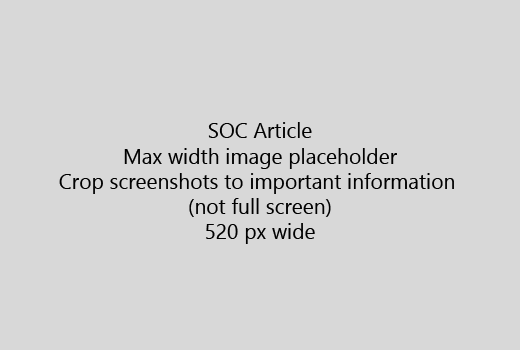

Inicie o seu artigo com uma introdução muito curta (1 frase). Ponha-se no local do leitor: razão pela qual são aqui? O que fazer? 
  
1. Obter directamente para rapidamente uma lista de passos para concluir a tarefa.
    
    Se é necessário explicar um conceito, ou que têm de efectuar passos previamente requeridos, adicione um resumo rápido abaixo do salto sempre que necessário e [ligação](https://support.office.com/article/f37e7984-cf03-4fde-92d3-82970d7e241b.aspx) para o conceito ou passos. 
    
2. Manter procedimentos curtos - passos, de preferência, 5 ou menos, não superior a 8.
    
3. Utilizar o **estilo da IU** para elementos da interface de utilizador ou para o texto necessitam introduzir as pessoas. 
    
4. Utilizar os verbos de escolha, seleccione, ou introduza como acções e formatar menus como **Menu** \> **comando**.
    
5. Opcionalmente, adicione uma imagem de ecrã para o contexto (se UI é difícil localizar ou necessário para concluir a tarefa).
    
    Largura máxima: 520 pixels. Utilizar um tema padrão, não mostrar todas as informações pessoais e de recorte para mostrar apenas o que é relevante. 
    
    
  
Se pretender adicionar um vídeo ou de captura de ecrã, utilize uma grelha de duas colunas e os passos no lado esquerdo e o vídeo ou de captura de ecrã à direita - consulte [os passos e um exemplo de grelha de vídeo](https://support.office.com/article/14ce8e82-efa0-47f5-bb84-94f078db3dae.aspx). 
  
Não superior a 500 palavras de um artigo de destino.
  
# Artigo de exemplo

[Alterar as minhas fotografias](https://support.office.com/article/555376e0-1fca-49ba-8434-307a0525c767.aspx)
  

