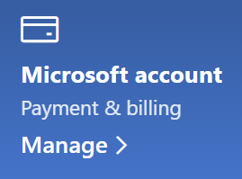

# Alterar as informações da minha conta Microsoft

Aceda a [https://account.microsoft.com](https://account.microsoft.com/) e inicie sessão se for necessário. Esta ação irá redirecioná-lo para o seu dashboard de conta.  

**Editar o meu nome e informações pessoais**

1. No dashboard da sua conta, junto à imagem e nome da sua conta, clique nas retas (mais ações) > Editar perfil**.
2. Na página **Editar perfil**, utilize as ligações fornecidas para alterar a sua imagem de perfil, o nome, a data de nascimento, a localização e a preferência de idioma de visualização. Repare nas ligações para os seus perfis das contas Xbox ou Skype, onde pode alterar os detalhes específicos dessas contas.

**Gerir endereços de e-mail e números de telefone**

Uma conta Microsoft tem um ou mais endereços de e-mail ou números de telefone associados à mesma como "aliases". Para geri-los:

1. No dashboard da sua conta, junto à imagem e nome da sua conta, clique nas retas (mais ações) no > **Editar perfil.**
2. Na página **Editar perfil**, clique em **Gerir a forma como inicia sessão na conta Microsoft**. 
3. Verá uma lista dos aliases de conta que pode gerir, incluindo adicionar e eliminar endereços de e-mail e números de telefone. Aqui também pode selecionar que aliases podem ser utilizados para iniciar sessão na conta e que alias é considerado "principal", algo que será apresentado nos seus dispositivos Windows 10.

**Gerir métodos de pagamento, bem como o nome e endereço da faturação** 

1. No dashboard da sua conta, junto à imagem e nome da sua conta, clique nas retas (mais ações) no > **Editar perfil.**
2. Em **Pagamento e faturação**, clique em **Gerir**.

    

3. Aqui pode adicionar, editar e remover métodos de pagamento e os seus endereços de faturação associados. 
