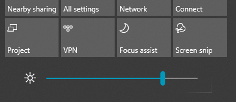

# Alterar a luminosidade do ecrã no Windows 10

Se o seu Windows 10 for mais recente do que a versão 1903, possui um **Controlo de deslize de luminosidade** no centro de ação. Para abrir o centro de ação, clique no botão **Notificação** na extremidade direita da barra de tarefas ou prima **Windows home + A** no seu teclado.

Se o seu Windows 10 for uma versão anterior, pode encontrar o controlo de deslize de luminosidade ao aceder a **[Definições > Sistema > Visualização](ms-settings:display?activationSource=GetHelp)**.

**Notas**:

- Poderá não ver Alterar luminosidade no controlo de deslize de visualização incorporado em PCs de secretária que têm um monitor externo. Para alterar a luminosidade de um monitor externo, utilize os controlos no monitor.
- Se não tiver um PC de secretária e o controlo de deslize não aparecer ou não funcionar, experimente atualizar o controlador de visualização. Na caixa de pesquisa na barra de tarefas, escreva **Gestor de Dispositivos** e, em seguida, selecione **Gestor de Dispositivos** na lista de resultados. Em **Gestor de Dispositivos**, selecione **Placas Gráficas** e, em seguida, selecione a placa gráfica. Prima continuamente (ou clique com o botão direito do rato) no nome da placa gráfica e clique em **Atualizar controlador**; em seguida, siga as instruções.
