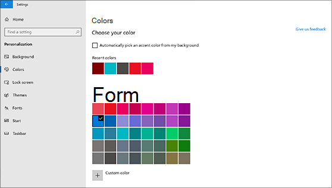
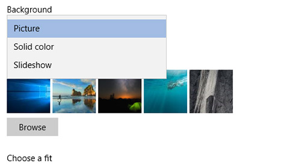

# Alterar o fundo e as cores do ambiente de trabalho

Para alterar a definição de cores, vá a Iniciar Definições Cores de  >    >  **Personalização**  >  e, em seguida, escolha a sua própria cor ou permita que Windows uma cor de destaque do fundo.

Para alterar o fundo de ambiente de trabalho, vá a Iniciar Definições Fundo de Personalização e, em seguida, escolha uma imagem, cor sólida ou crie uma apresentação de  >    >    >  diapositivos de imagens. 

Quer mais fundos e cores do ambiente de trabalho? Visite [Microsoft Store](https://www.microsoft.com/store/collections/windowsthemes) para escolher entre dezenas de temas gratuitos.
