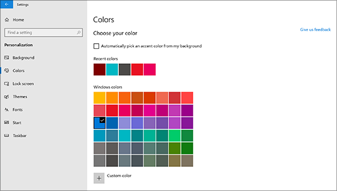

# Mude o fundo e as cores do seu ambiente de trabalho

Para alterar a definição de cores, vá para **Iniciar**  >  **Definições**  >  **Cores de Personalização**, e depois escolha a sua própria cor ou deixe o Windows puxar uma cor de  >  **Colors**acento do seu fundo.

Para alterar o fundo do seu ambiente de trabalho, vá ao **Fundo de**Personalização de Definições de Início  >  **Settings**  >  **Personalization**  >  **Background**e, em seguida, escolha uma imagem, cor sólida ou crie uma apresentação de imagens. 

Quer mais fundos e cores de ambiente de trabalho? Visite a [Microsoft Store](https://www.microsoft.com/store/collections/windowsthemes) para escolher entre dezenas de temas gratuitos.
