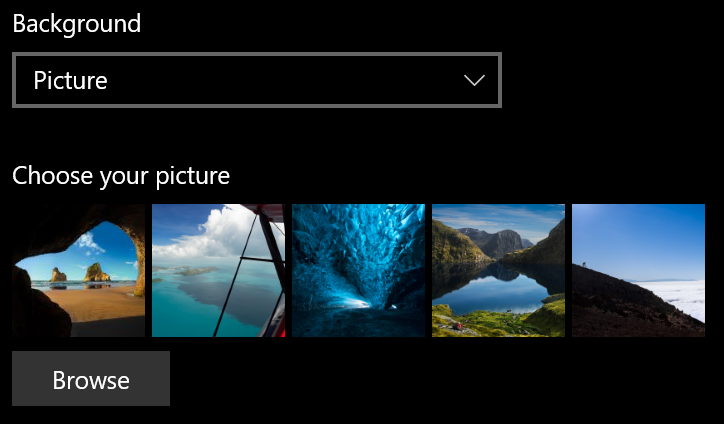
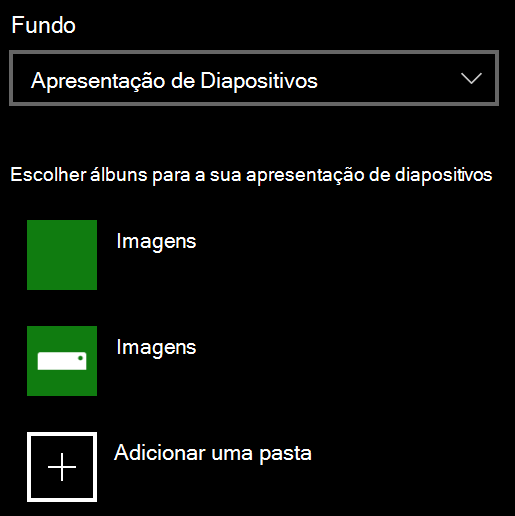

# Mude o fundo do ecrã de bloqueioChange your lock screen background

- Ir para o ecrã de bloqueio de personalização **de**  >  **definições**  >  **Lock screen**.Go to **Settings** > **Personalization** > **Lock screen**. Ou clique ou toque [aqui.](ms-settings:lockscreen?activationSource=GetHelp)Or click or tap [here](ms-settings:lockscreen?activationSource=GetHelp).

- Para definir uma imagem de fundo personalizada, selecione **Imagem** da lista de drop-down de **fundo** e escolha ou **navegue** para a imagem.To set a custom background picture, select **Picture** from the **Background** drop-down list, and choose or **Browse** to the picture.

  

- Para configurar uma apresentação de diapositivos de imagens personalizadas, selecione **Slideshow** da lista de down-down **background** e escolha um álbum ou adicione uma pasta que contenha as imagens para a apresentação de diapositivos.To set up a slideshow of custom pictures, select **Slideshow** from the **Background** drop-down list, and choose an album or add a folder that contains the pictures for the slideshow.

  
