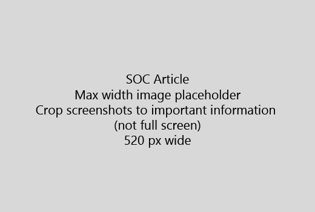

Inicie o seu artigo com uma introdução muito curta (1 frase). Ponha-se no local do leitor: razão pela qual são aqui? O que fazer?Start your article with a very short introduction (1 sentence). Put yourself in the reader's place - why are they here? What should they do? 
  
1. Obter directamente para rapidamente uma lista de passos para concluir a tarefa.Get straight to a quick list of steps to accomplish the task.
    
    Se é necessário explicar um conceito, ou que têm de efectuar passos previamente requeridos, adicione um resumo rápido abaixo do salto sempre que necessário e [ligação](https://support.office.com/article/f37e7984-cf03-4fde-92d3-82970d7e241b.aspx) para o conceito ou passos.If you need to explain a concept, or they have to do pre-requisite steps, add a quick summary below the step where they need it, and [link](https://support.office.com/article/f37e7984-cf03-4fde-92d3-82970d7e241b.aspx) to the concept or steps. 
    
2. Manter procedimentos curtos - passos, de preferência, 5 ou menos, não superior a 8.Keep procedures short - preferably 5 or fewer steps, no more than 8.
    
3. Utilizar o **estilo da IU** para elementos da interface de utilizador ou para o texto necessitam introduzir as pessoas.Use **Ui style** for user interface elements or for text people need to enter. 
    
4. Utilizar os verbos de escolha, seleccione, ou introduza como acções e formatar menus como **Menu** \> **comando**.Use the verbs choose, select, or enter as actions, and format menus as **Menu** \> **Command**.
    
5. Opcionalmente, adicione uma imagem de ecrã para o contexto (se UI é difícil localizar ou necessário para concluir a tarefa).Optionally, add a screenshot for context (if UI is hard to locate, or it's needed to complete the task).
    
    Largura máxima: 520 pixels. Utilizar um tema padrão, não mostrar todas as informações pessoais e de recorte para mostrar apenas o que é relevante.Maximum width: 520 pixels. Use a standard theme, do not show any personal information, and crop to show only what's relevant. 
    
    
  
Se pretender adicionar um vídeo ou de captura de ecrã, utilize uma grelha de duas colunas e os passos no lado esquerdo e o vídeo ou de captura de ecrã à direita - consulte [os passos e um exemplo de grelha de vídeo](https://support.office.com/article/14ce8e82-efa0-47f5-bb84-94f078db3dae.aspx).If you want to add a video or screenshot, use a two-column grid and have the steps in the left and the video or screenshot in the right - see [Steps and video grid example](https://support.office.com/article/14ce8e82-efa0-47f5-bb84-94f078db3dae.aspx). 
  
Não superior a 500 palavras de um artigo de destino.Target no more than 500 words for an article.
  
# Artigo de exemploExample article

[Alterar as minhas fotografiasChange my photo](https://support.office.com/article/555376e0-1fca-49ba-8434-307a0525c767.aspx)
  

