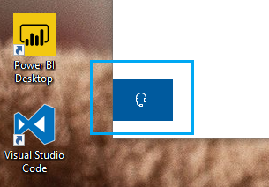

# Contacte-nos ao clicar no botão dos auscultadores

Se quiser contactar o Suporte da  Microsoft, clique em Contacte-nos no canto inferior esquerdo desta aplicação. No interior da janela de voo, será guiado para o canal de suporte certo depois de escolher o seu produto e categoria de problema.

Pode continuar a interagir com o resto da aplicação mesmo depois de iniciar uma sessão em Contacte-nos. O painel Contacte-nos pode ser temporariamente minimizado ao clicar em qualquer outro local dentro da aplicação. Para voltar à mesma sessão, basta clicar **em Contacte-nos** novamente.
