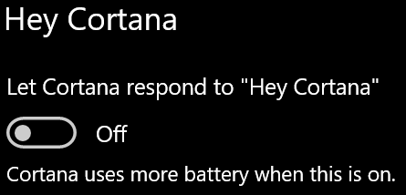

# A Cortana não fala comigo ou não consegue me ouvirCortana doesn’t talk to me or can’t hear me

Se você estiver a tentar usar a funcionalidade "Olá Cortana", que permite falar com a Cortana sem selecionar o botão Cortana na barra de tarefas ou o botão de microfone no painel da Cortana, confirme se a funcionalidade está ativada:If you are trying to use the "Hey Cortana" feature, which allows you to talk to Cortana without selecting the Cortana button on the taskbar or the microphone button in the Cortana panel, confirm that the feature is enabled:

1. Aceda a **Iniciar** e, em seguida, selecione **[Definições > Cortana](ms-settings:cortana?activationSource=GetHelp)**.Go to **Start**, then select **[Settings > Cortana](ms-settings:cortana?activationSource=GetHelp)**.
2. Em **Olá Cortana**, mude o **Permitir que a Cortana responda a "Olá Cortana"** para **Ligado**.Under **Hey Cortana**, switch the **Let Cortana respond to "Hey Cortana"** toggle to **On**.

**As suas definições de privacidade evitam que a Cortana o escute?****Are your privacy settings preventing Cortana from hearing you?**

As suas definições de privacidade podem impedir a Cortana de responder à sua voz.Your privacy settings can prevent Cortana from responding to your voice.
- Certifique-se de que o Reconhecimento de Voz Online está ativado:Check to make sure Online Speech recognition is turned on:
    - Aceda a **Iniciar** e, em seguida, clique em **[Definições > Privacidade > Voz](ms-settings:privacy-speech?activationSource=GetHelp)**.Go to **Start**, then click **[Settings > Privacy > Speech](ms-settings:privacy-speech?activationSource=GetHelp)**.
    - Em **Reconhecimento de Voz Online**, mude a definição para **Ligado**.Under **Online speech recognition**, switch the setting to **On**.
- Certifique-se de que a Cortana tem permissão para aceder ao seu microfone.Check to make sure Cortana has permission to access your microphone. 
    - Aceda a Iniciar e, em seguida, clique em **[Definições > Privacidade > Microfone](ms-settings:privacy-microphone?activationSource=GetHelp)**.Go to Start, then click **[Settings > Privacy > Microphone](ms-settings:privacy-microphone?activationSource=GetHelp)**.
    - Em **Selecione as aplicações que podem aceder ao seu microfone**, procure por **Cortana** dentro da lista de aplicações e serviços e certifique-se de que o botão está voltado para **Ligado**.Under **Choose which apps can access your microphone**, look for **Cortana** within the list of apps and services and make sure the switch is toggled to **On**.

Além disso, certifique-se também de que os seus altifalantes ou microfones estão ativos e a funcionar para falar com a Cortana.Moreover, please also make sure that your speakers or microphones are up and working in order to talk to Cortana.
