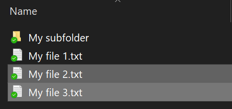
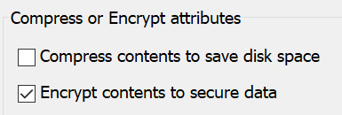

# Encriptar ficheiros ou pastas no Windows 10Encrypt files or folder in Windows 10

Pode encriptar um disco inteiro usando o BitLocker, mas apenas para encriptar ficheiros ou pastas individuais (e os seus conteúdos):You can encrypt an entire disk using BitLocker, but to encrypt only individual files or folders (and their contents):

1. No **Explorador de Ficheiros**, selecione o(s) ficheiro(s) que deseja encriptar.In **File Explorer**, select the file(s)/folder(s) you want to encrypt. Neste exemplo, foram selecionados dois ficheiros:In this example, two files have been selected:

    

2. Clique com o botão direito nos ficheiros selecionados e clique em **Propriedades**.Right-click the selected files and click **Properties**.

3. Na janela **Propriedades**, clique em **Avançado**.In the **Properties** window, click **Advanced**.

4. Na janela **Propriedades avançadas**, selecione a caixa de verificação **Encriptar conteúdos para proteger dados**:In the **Advanced Properties** window, select the **Encrypt contents to secure data** checkbox:

    

5. Clique em **OK**.Click **OK**.
