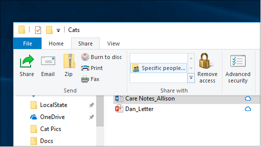

# Partilha de ficheiros sobre uma rede no Windows 10File sharing over a network in Windows 10

**Nota**: Se já utilizou o HomeGroup para partilha de ficheiros, tenha em atenção que o HomeGroup foi removido do Windows 10 (Versão 1803).**Note**: If you previously used HomeGroup for file sharing, please note that HomeGroup has been removed from Windows 10 (Version 1803). Agora pode partilhar impressoras e ficheiros utilizando funcionalidades incorporadas no Windows 10.You can now share printers and files by using built-in features in Windows 10.

**Para partilhar ficheiros ou pastas sobre uma rede****To share files or folders over a network**

- No **File Explorer,** selecione um ficheiro > clique no separador **Partilhar** no > superior na secção **Partilhar,** clique em **pessoas específicas**.In **File Explorer**, select a file > click the **Share** tab at the top > in the **Share with** section, click **Specific people**.

    
          
- Se selecionar vários ficheiros ao mesmo tempo, pode partilhá-los todos da mesma forma.If you select multiple files at once, you can share them all in the same way. Também funciona para pastas.It works for folders, too.

**Para ver dispositivos na rede que estão a partilhar ficheiros****To see devices on the network that are sharing files**

- No **File Explorer,** vá à **Rede**.In **File Explorer**, go to **Network**. Se a descoberta da Rede não estiver ativada, verá uma mensagem de erro "A descoberta da rede está desligada..."If Network discovery is not enabled, you will see an error message "Network discovery is turned off..."

- Clique na descoberta da **Rede e desliga** o banner e, em seguida, clique **em Ligar a descoberta da rede e partilhar ficheiros**.Click the **Network discovery is turned off** banner, then click **Turn on network discovery and file sharing**.

    

[Ler mais sobre partilha de ficheiros sobre uma redeRead more about file sharing over a network](https://support.microsoft.com/help/4092694/windows-10-file-sharing-over-a-network)

[Partilhar ficheiros usando apps, OneDrive, e-mails e muito maisShare files using apps, OneDrive, emails, and more](https://support.microsoft.com/help/4027674/windows-10-share-files-in-file-explorer)
