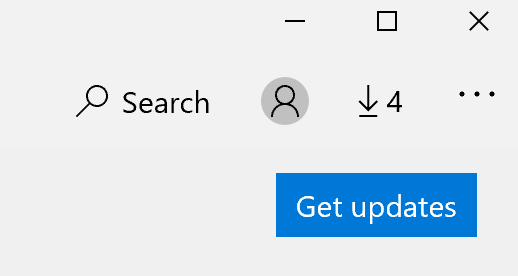

# Corrigir o idioma de exibição de apps

Depois de alterar o idioma de exibição no Windows 10, algumas aplicações podem ainda utilizar o idioma anterior quando as abrir. Isto acontece porque as novas versões das aplicações para esse idioma devem ser descarregadas a partir da Loja. Para corrigir este problema, pode esperar pela atualização automática ou pode instalar manualmente a versão atualizada das aplicações.

Para instalar manualmente a atualização, abra a **Microsoft Store** e clique em **Downloads e atualizações** no canto superior direito. Em seguida, clique em **Obter atualizações**. Se o idioma não for alterado após a atualização estar completa, tente reiniciar o seu PC.

Para ler mais sobre as definições de idioma de entrada e visualização, consulte Gerir as definições de idiomas de [entrada e visualização no Windows 10](https://support.microsoft.com/help/4027670/windows-10-add-and-switch-input-and-display-language-preferences).
