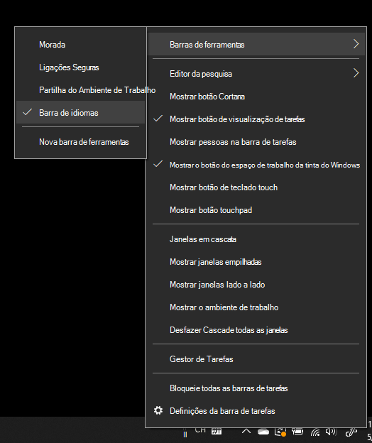
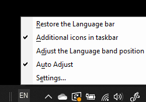

# Ocultar, apresentar ou repor a barra de idiomasHide, display, or reset the language bar

**Para minimizar a barra de idiomas:****To minimize the language bar:**

Pode clicar no botão minimizar no canto superior direito da barra de idiomas.You can click the minimize button on the top right corner of the language bar. Ou pode simplesmente arrastar a barra de idiomas para a barra de tarefas, o que irá minimizá-la automaticamente.Or, you can just drag the language bar to the task bar, which will automatically minimize it.

**Para isolar a barra de idiomas:****To pop out the language bar:**

Se não pretender ancorar a barra de idiomas na barra de tarefas, clique com o botão direito do rato num espaço vazio na barra de tarefas e desmarque a opção **Barra de idiomas** no menu Barra de Ferramentas.If you don't want to dock the language bar in the taskbar, right-click any empty space in the taskbar, and uncheck the **Language bar** option in the Toolbars menu. Isso fará com que a barra de idiomas seja apresentada fora da barra de tarefas, da mesma forma que a captura de ecrã anterior.This will make the language bar appear outside the taskbar, just like the previous screenshot.

**Para restaurar a barra de idiomas para sua predefinição:****To restore the language bar to default:**

Clique com o botão direito do rato no botão idioma na barra de ferramentas e clique na opção **Restaurar a barra de idiomas** no menu.Right-click the language button in the toolbar, and click **Restore the language bar** option in the menu. Isto irá restaurá-la para sua predefinição.This will restore it to default.

