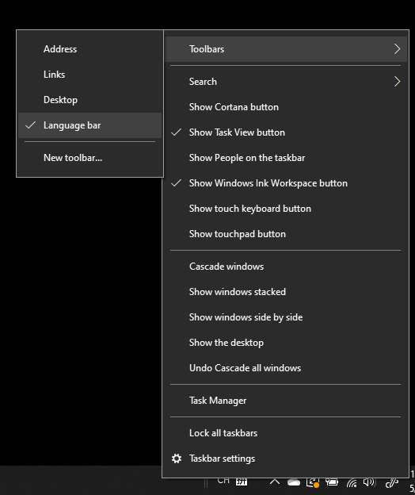

# Ocultar, apresentar ou repor a barra de idiomas

**Para minimizar a barra de idiomas:**

Pode clicar no botão minimizar no canto superior direito da barra de idiomas. Ou pode simplesmente arrastar a barra de idiomas para a barra de tarefas, o que irá minimizá-la automaticamente.

**Para isolar a barra de idiomas:**

Se não pretender ancorar a barra de idiomas na barra de tarefas, clique com o botão direito do rato num espaço vazio na barra de tarefas e desmarque a opção **Barra de idiomas** no menu Barra de Ferramentas. Isso fará com que a barra de idiomas seja apresentada fora da barra de tarefas, da mesma forma que a captura de ecrã anterior.

**Para restaurar a barra de idiomas para sua predefinição:**

Clique com o botão direito do rato no botão idioma na barra de ferramentas e clique na opção **Restaurar a barra de idiomas** no menu. Isto irá restaurá-la para sua predefinição.

