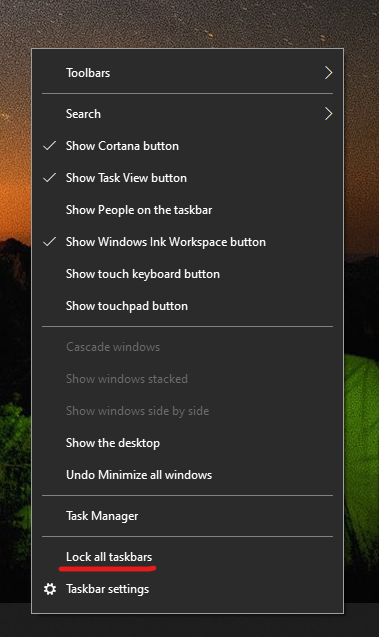

# Mover a barra de tarefas para o lado direito ou esquerdo ou para a parte superior do seu ambiente de trabalho

Primeiro, confirme que a barra de tarefas está desbloqueada. Para saber se a barra de tarefas está desbloqueada, clique com o botão direito do rato num espaço vazio na barra de tarefas e verifique se **Bloquear a barra de tarefas** possui uma marca de verificação ao lado. Se encontrar uma marca de verificação, a barra de tarefas está bloqueada e não pode ser movida. Clicar em **Bloquear a barra de tarefas** uma vez irá desbloqueá-la e remover a marca de verificação.

Se tiver vários monitores que apresentam a barra de tarefas, verá **Bloquear todas as barras de tarefas**.

Depois de desbloquear a barra de tarefas, pode premir continuamente qualquer espaço vazio na barra de tarefas e arrastá-la para a localização no ecrã que pretende. Também pode fazê-lo ao clicar com o botão direito do rato num espaço vazio na barra de tarefas e aceder a **[Definições da barra de tarefas](ms-settings:taskbar?activationSource=GetHelp) > Localização da barra de tarefas no ecrã**.
