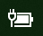

# Ícone de energia ou bateria em falta no Windows 10

Se o seu dispositivo Windows 10 tem uma bateria (por exemplo, um portátil ou tablet ou um PC ligado a uma UPS através de USB), normalmente, é apresentado um ícone de energia/bateria na barra de tarefas, perto do relógio. Por exemplo:

Se não vir este ícone, é possível que esteja oculto:

1. Aceda a **[Definições > Personalização > Barra de tarefas](ms-settings:taskbar?activationSource=GetHelp)**.

2. Na Área de notificação, clique em **Selecionar quais os ícones que aparecem na barra de tarefas**.

3. Em seguida, localize o item **Energia** na lista e altere a definição para **Ligado**.

    

**Resolução de Problemas**

Se seguiu as instruções acima e o botão de alternar a definição de **Energia** estiver a cinzento ou não estiver visível, na caixa de pesquisa da barra de tarefas, escreva **gestor de dispositivos** e, em seguida, selecione **Gestor de Dispositivos** na lista de resultados. Em **Baterias**, clique com o botão direito do rato na bateria do seu dispositivo, clique em **Desativar** e, em seguida, clique em **Sim**. Aguarde alguns segundos e, em seguida, clique com o botão direito do rato na bateria e clique em **Ativar**. Depois, reinicie o seu dispositivo.

Se seguiu as instruções acima, mas o ícone de bateria não estiver a ser apresentado na barra de tarefas, na caixa de pesquisa da barra de tarefas, escreva **gestor de tarefas** e, em seguida, clique em **Gestor de Tarefas** na lista de resultados. No separador **Processos**, em **Nome**, clique com o botão direito do rato em **Explorador** e, em seguida, clique em **Reiniciar**.
