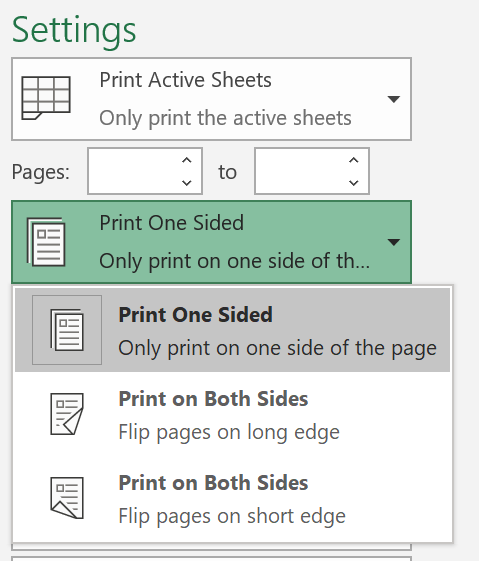
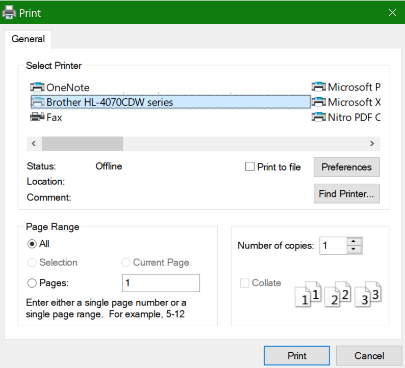

# Imprimir em ambos os lados do papel (impressão frente e verso)

**A minha impressora tem capacidade para impressão frente e verso?**

O resumo ou manual de funcionalidades da sua impressora deve dizer-lhe se é capaz de imprimir em ambos os lados do papel, também conhecido como "impressão frente e verso". Se tiver uma Microsoft Office, outra forma de descobrir é ao abrir um aplicação do Office como o Word ou o Excel, ao ir para Ficheiro **> Imprimir,** certificar-se de que a impressora certa está selecionada e procurar a funcionalidade na secção Definições. Por exemplo: 

**Impressão frente e verso no Microsoft Office**

Se a sua impressora for capaz de imprimir dos dois lados, ao ir para Ficheiro **>** Imprimir no aplicação do Office, verá uma opção para "Imprimir dos Dois Lados", conforme mostrado no exemplo acima.  Selecione o tipo de impressão frente e verso que pretende (inverter o limite longo ou inverter no limite curto) e clique em Imprimir para iniciar a impressão. 

**Impressão em duplex a partir de qualquer aplicação**

Em muitas aplicações quando imprimir, verá uma caixa de diálogo de impressão geral com este aspas: 

Certifique-se de que está selecionada a impressora certa e, em seguida, clique em **Preferências** para abrir a janela de preferências da impressora. Se a impressora for capaz de imprimir frente e verso, a capacidade de ativar esta função para a tarefa de impressão atual será mostrada nessa janela.
