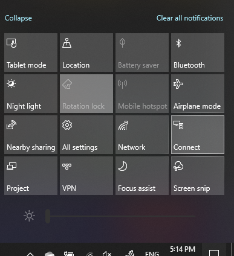

# Project a um PC

No seu dispositivo de destino (a projetar para), procure por "Projetos Definições" para abrir a página de Definições de Projetar **para este PC**. Em seguida, certifique-se de que:
- O menu Windows dispositivos Android e "Alguns dispositivos Android podem projetar para este PC quando diz que não há problema", está definido como **Sempre Desligado.**
- O menu superior "Pedir para projetar para este PC" está definido para Sempre que **é necessária uma ligação**.
- O menu de listagem "Exigir PIN para emparelhar" está definido para **Nunca.**

No seu dispositivo de destino, **inic Ligação** aplicação ao ir **para** Iniciar e procure por "Ligação".

Em seguida, no seu dispositivo de origem a partir do onde está a tentar projetar:

1. Prima **a Windows +A para abrir** o Centro de Ação.
2. Clique **Ligação**.
3. Clique no dispositivo em que pretende projetar o ecrã.

Após os passos acima, o seu dispositivo de destino deverá apresentar o ecrã do dispositivo de origem como se fosse um monitor secundário.
