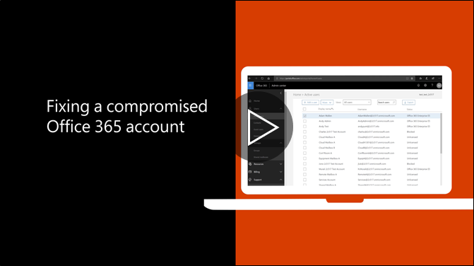

# Passos recomendados que deverá tomar se uma conta for comprometidaRecommended steps to take if an account is compromised

  
1. [Repor a palavra-passe do utilizador](https://support.office.com/article/7a5d073b-7fae-4aa5-8f96-9ecd041aba9c) imediatamente. Não comunicar a nova palavra-passe através do correio electrónico para o utilizador final.[Reset the user's password](https://support.office.com/article/7a5d073b-7fae-4aa5-8f96-9ecd041aba9c) immediately. Do not communicate the new password through email to the end user. 
    
2. Remova qualquer suspeita [Reencaminhar endereços](https://support.office.com/article/ab5eb117-0f22-4fa7-a662-3a6bdb0add74) definidas a nível da caixa de correio.Remove any suspicious [forwarding addresses](https://support.office.com/article/ab5eb117-0f22-4fa7-a662-3a6bdb0add74) set at the mailbox level. 
    
3. Remova qualquer suspeita [regras da pasta a receber](https://support.office.com/article/1433E3A0-7FB0-4999-B536-50E05CB67FED) dentro da caixa de correio.Remove any suspicious [inbox rules](https://support.office.com/article/1433E3A0-7FB0-4999-B536-50E05CB67FED) set within the mailbox. 
    
4. Se o utilizador está impedido de enviar correio electrónico, [Vá para os utilizadores restritos para desbloquear a conta](https://protection.office.com/?hash=/restrictedusers). Uma vez concluído, o utilizador poderá continuar a enviar mensagens dentro de 1 hora.If the user is blocked from sending email, [go to the Restricted Users to unblock the account](https://protection.office.com/?hash=/restrictedusers). Once done, the user should be able to resume sending messages within 1 hour.
    
5. Remova a conta de utilizador de quaisquer [grupos de funções administrativas](https://support.office.com/article/eac4d046-1afd-4f1a-85fc-8219c79e1504) até estar certo de que a conta já não é comprometida.Remove the user account from any [administrative role groups](https://support.office.com/article/eac4d046-1afd-4f1a-85fc-8219c79e1504) until you are confident that the account is no longer compromised. 
    
Para minimizar a possibilidade de uma fuga de dados ou uma conta comprometida no futuro, recomenda-se ao ler a nossa [artigo de práticas melhor segurança do Office 365](https://support.office.com/article/9295e396-e53d-49b9-ae9b-0b5828cdedc3).To minimize the potential of a data breach or a compromised account in the future, we recommend reading our [Office 365 Security best practices article](https://support.office.com/article/9295e396-e53d-49b9-ae9b-0b5828cdedc3).
  

