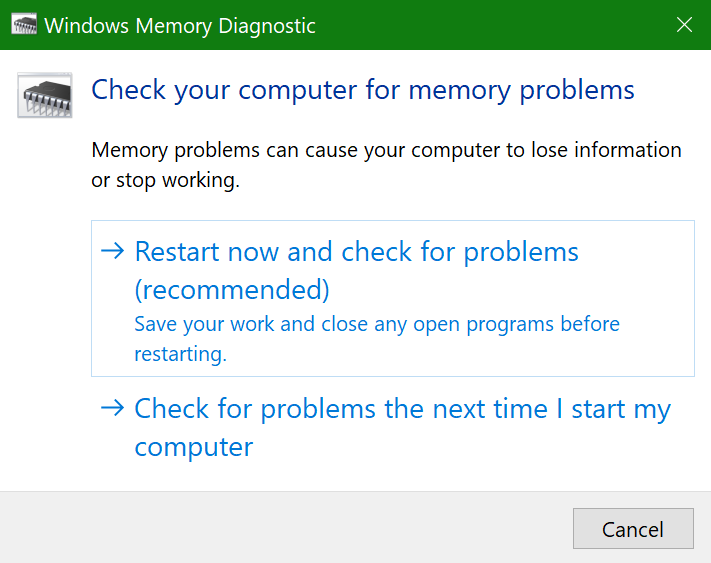

# Executar diagnósticos de memória do Windows no Windows 10

Se o Windows e as aplicações no seu PC estiverem a falhar, congelar ou agir de forma instável, poderá ter um problema com a memória do PC (RAM). Pode executar o Diagnóstico de Memória do Windows para verificar se há problemas com a RAM do PC.

Na caixa de pesquisa na sua barra de tarefas, escreva **diagnóstico de memória** e, em seguida, selecione o Diagnóstico de Memória do **Windows**. 

Para executar o diagnóstico, o PC precisa de reiniciar. Tem a opção de reiniciar imediatamente (por favor, guarde o seu trabalho e feche primeiro os documentos e e-mails abertos), ou agende o diagnóstico para ser executado automaticamente da próxima vez que o PC recomeçar:

Quando o PC reiniciar, a **Ferramenta de Diagnóstico de Memória do Windows** será executada automaticamente. O estado e o progresso serão apresentados à medida que os diagnósticos são executados, e você tem a opção de cancelar os diagnósticos, atingindo a tecla **ESC** no seu teclado.

Quando os diagnósticos estiverem completos, o Windows começará normalmente.
Imediatamente após o reinício, quando o Ambiente de Trabalho aparecer, aparecerá uma notificação (junto ao ícone **do Centro de Ação** na barra de tarefas), para indicar se foram encontrados erros de memória. Por exemplo:

Aqui está o ícone do Centro de Ação:  

E uma notificação de amostra: 

Se perdeu a notificação, pode selecionar o ícone **do Centro de Ação** na barra de tarefas para exibir o Centro de **Ação** e ver uma lista de notificações que possam ser apresentadas.

Para rever informações detalhadas, digite o **evento** na caixa de pesquisa na sua barra de tarefas e, em seguida, selecione **Event Viewer**. No painel esquerdo do Espectador de **Eventos,** navegue para o **Sistema de Registos > do Windows**. No painel direito, verifique a lista enquanto olha para a coluna **Fonte,** até ver eventos com valor de Origem **MemoryDiagnostics-Resultados**. Realce cada evento e veja as informações de resultados na caixa no separador **Geral** abaixo da lista.
