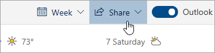

# Partilhar com o Outlook na webSharing with Outlook on the web

1. Na parte inferior da página, selecione Calendário para ir ao Calendário.At the bottom of the page, select Calendar to go to Calendar.

2. No Calendário, na barra de ferramentas no topo da página, selecione **Partilhar**, e escolha o calendário que pretende partilhar.In Calendar, on the toolbar at the top of the page, select **Share**, and choose the calendar you want to share. 

    

    **Nota:** Não pode partilhar calendários de outras pessoas.**Note**: You can't share calendars owned by other people.

3. Insira o nome ou endereço de e-mail da pessoa com quem pretende partilhar o seu calendário.Enter the name or email address of the person you want to share your calendar with.

4. Escolha como pretende que a pessoa utilize o seu calendário:Choose how you want the person to use your calendar: 
    - **Posso ver quando estou ocupado**   Permite-lhes ver quando estão ocupados, mas não incluem detalhes como a localização do evento.**Can view when I'm busy** lets them see when you're busy but doesn't include details like the event location. 
    - **Pode ver títulos e locais**   permite-lhes ver quando estão ocupados, bem como o título e a localização dos eventos.**Can view titles and locations** lets them see when you're busy, as well as the title and location of events. 
    - **Pode ver todos os detalhes**   Permite-lhes ver todos os detalhes dos seus eventos.**Can view all details** lets them see all the details of your events. 
    - **Pode editar**   Permite-lhes editar o seu calendário.**Can edit** lets them edit your calendar. 
    - **Delegado**   permite-lhes editar o seu calendário e partilhá-lo com os outros.**Delegate** lets them edit your calendar and share it with others.

5. Selecione **Partilhar**.Select **Share**. Se decidir não partilhar o seu calendário agora, selecione **Remover**.If you decide not to share your calendar right now, select **Remove**. 

**Notas:****Notes**:  

- Ao partilhar o seu calendário com alguém que não está a usar o Outlook na web, por exemplo, alguém que usa o Gmail, só poderá aceitar o convite usando uma conta Microsoft 365 ou uma conta Outlook.com.When sharing your calendar with someone who's not using Outlook on the web, for example, someone using Gmail, they'll only be able to accept the invitation using a Microsoft 365 or an Outlook.com account. 

- Os calendários do ICS são apenas para leitura, por isso mesmo que conceda o acesso a outras pessoas, eles não serão capazes de editar o seu calendário.ICS calendars are read-only, so even if you grant edit access to other people, they won't be able to edit your calendar. 

- A frequência com que os seus sincronizados de calendário do ICS dependem do fornecedor de e-mail da pessoa com quem o partilhou.How often your ICS calendar syncs depends on the email provider of the person you've shared it with. 

- Os itens de calendário marcados para privados estão protegidos.Calendar items marked private are protected. A maioria das pessoas com quem partilha o seu calendário vê apenas o tempo dos itens marcados privados, não o título, localização ou outros detalhes.Most people you share your calendar with see only the time of items marked private, not the title, location, or other details. Séries recorrentes marcadas como privadas também mostrarão o padrão de recorrência.Recurring series marked as private will also show the recurrence pattern.
