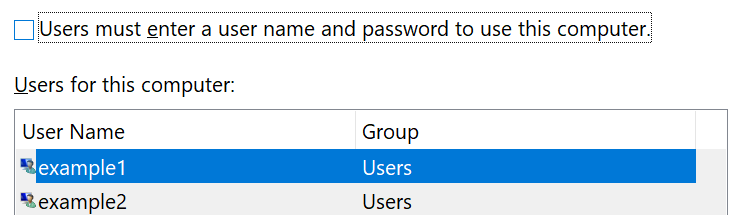

# Iniciar sessão no Windows 10 sem usar uma senhaSign-in to Windows 10 without using a password

Para evitar ter de escrever uma palavra-passe no arranque do Windows, recomendamos que utilize uma das opções de entrada segura do Windows Hello, como um PIN, reconhecimento facial ou impressão digital, se disponível.To avoid having to type a password at Windows startup, we recommend you use one of the Windows Hello secure sign-in options, like a PIN, face recognition, or fingerprint, if available. Se realmente quiser desativar o acesso seguro, consulte as instruções "Iniciar automaticamente o sessão no Windows 10" abaixo.If you really want to disable secure sign-in, see the "Automatically sign in to Windows 10" instructions below.

**Alternativas Secure Windows Hello à palavra-passe da conta****Secure Windows Hello alternatives to the account password**

Vá a **Definições > Contas > opções de iniciar sessão** (ou clique [aqui](ms-settings:signinoptions?activationSource=GetHelp)).Go to **Settings  > Accounts > Sign-in options** (or click [here](ms-settings:signinoptions?activationSource=GetHelp)). As opções de inscrição disponíveis serão listadas.Available sign-in options will be listed. Por exemplo:For example:

Clique ou toque numa das opções para configurá-lo.Click or tap one of the options to configure it. Da próxima vez que iniciar ou desbloquear o Windows, poderá utilizar a nova opção em vez de uma palavra-passe.Next time you start or unlock Windows, you will be able to use the new option instead of a password. 

**Iniciar sessão automática no Windows 10****Automatically sign-in to Windows 10**

**Nota:** O início automático é conveniente, mas introduz um risco de segurança, especialmente se o seu PC estiver acessível por várias pessoas.**Note**: Automatic sign-in is convenient, but introduces a security risk, especially if your PC is accessible by multiple people. 

1. Clique ou toque no botão **Iniciar** na barra de tarefas.Click or tap the **Start** button in the Taskbar.

2. Digite **netplwiz** e acerte na tecla Enter para abrir a janela contas do utilizador.Type **netplwiz** and hit the Enter key to open the User Accounts window.

3. Nas **Contas do Utilizador,** clique na conta para a sua assinatura automaticamente quando o Windows começar.In **User Accounts**, click the account you want to automatically sign in to when Windows starts.

4. Desmarque a caixa de verificação "Os utilizadores devem introduzir um nome de utilizador e uma senha para utilizar este computador".Uncheck the "Users must enter a user name and password to use this computer" checkbox.

    

5. Clique em **OK**.Click **OK**. Será-lhe pedido que introduza e confirme a palavra-passe para a conta selecionada.You will be asked to enter and confirm the password for the account you selected. Clique **em OK** para terminar.Click **OK** to finish. Da próxima vez que o Windows 10 começar, iniciará automaticamente o seu início na conta selecionada.Next time Windows 10 starts, it will automatically sign in to the account you selected.
