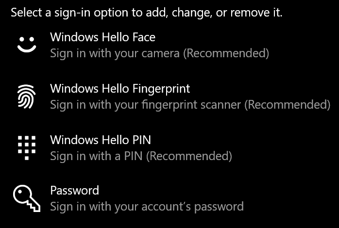

# Iniciar s-in no Windows 10 sem utilizar uma senhaSign-in to Windows 10 without using a password

Para evitar ter de escrever uma palavra-passe no arranque do Windows, recomendamos que utilize uma das opções de entrada segura do Windows Hello, como um PIN, reconhecimento facial ou impressão digital, se disponível.To avoid having to type a password at Windows startup, we recommend you use one of the Windows Hello secure sign-in options, like a PIN, face recognition, or fingerprint, if available. Se realmente pretender desativar o s-in seguro, consulte as instruções "Iniciar automaticamente o Windows 10" abaixo.If you really want to disable secure sign-in, see the "Automatically sign in to Windows 10" instructions below.

**Secure Windows Hello alternativas à senha de conta****Secure Windows Hello alternatives to the account password**

Aceda a **Definições > Contas > opções de inscrição** (ou clique [aqui).](ms-settings:signinoptions?activationSource=GetHelp)Go to **Settings  > Accounts > Sign-in options** (or click [here](ms-settings:signinoptions?activationSource=GetHelp)). As opções de inscrição disponíveis serão listadas.Available sign-in options will be listed. Por exemplo:For example:

Clique ou toque numa das opções para configurá-lo.Click or tap one of the options to configure it. Da próxima vez que iniciar ou desbloquear o Windows, poderá utilizar a nova opção em vez de uma palavra-passe.Next time you start or unlock Windows, you will be able to use the new option instead of a password. 

**Iniciar automaticamente o ó20.****Automatically sign-in to Windows 10**

**Nota:** O acesso automático é conveniente, mas introduz um risco de segurança, especialmente se o seu PC estiver acessível por várias pessoas.**Note**: Automatic sign-in is convenient, but introduces a security risk, especially if your PC is accessible by multiple people. 

1. Clique ou toque no botão **Iniciar** na barra de tarefas.Click or tap the **Start** button in the Taskbar.

2. Digite **netplwiz** e bata na tecla 'Introduzir' para abrir a janela Contas de Utilizador.Type **netplwiz** and hit the Enter key to open the User Accounts window.

3. Nas **Contas de Utilizador,** clique na conta a que pretende iniciar automaticamente o seu início.In **User Accounts**, click the account you want to automatically sign in to when Windows starts.

4. Desmarque a caixa de verificação "Os utilizadores devem introduzir um nome de utilizador e uma palavra-passe para utilizar este computador".Uncheck the "Users must enter a user name and password to use this computer" checkbox.

    

5. Clique em **OK**.Click **OK**. Ser-lhe-á pedido que introduza e confirme a palavra-passe para a conta que selecionou.You will be asked to enter and confirm the password for the account you selected. Clique **em OK** para terminar.Click **OK** to finish. Da próxima vez que o Windows 10 começar, iniciará automaticamente o s registação na conta selecionada.Next time Windows 10 starts, it will automatically sign in to the account you selected.
