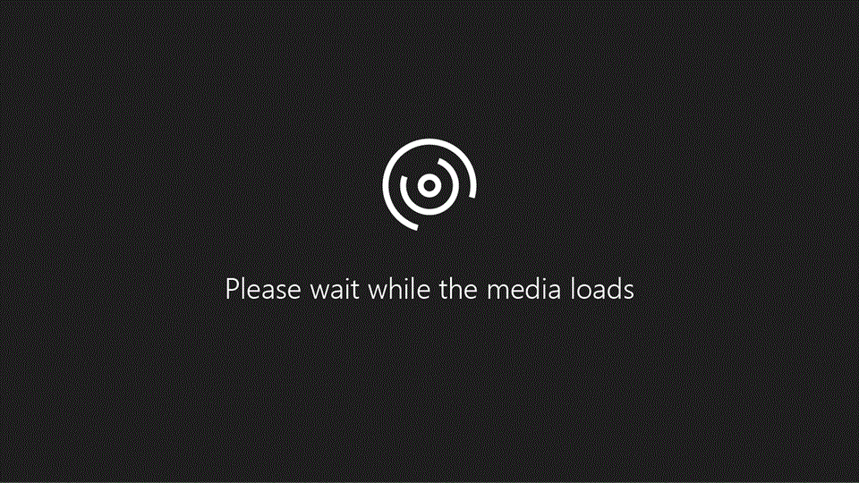

# Configurar o domínio e utilizadores

Quando estiver pronto para configurar o domínio e os utilizadores, assista a este vídeo rápido:
  

  
Para mais informações, consulte o [FAQ de domínios.](https://docs.microsoft.com/office365/admin/setup/domains-faq)
  

