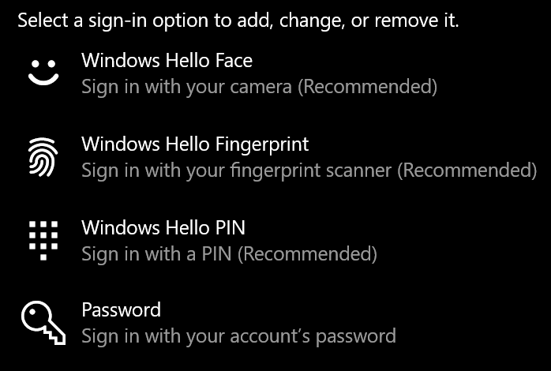
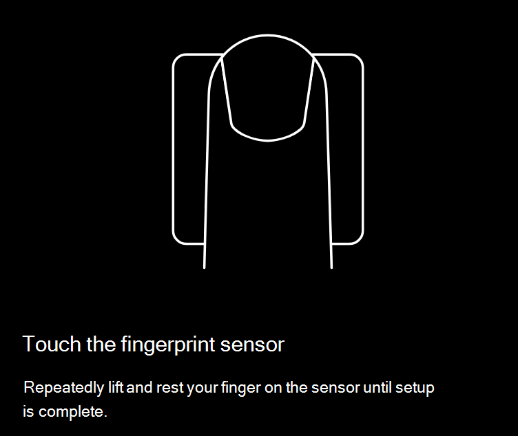
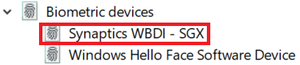

# Utilizar a opção de desbloqueio por impressão Windows 10

**Ativar Windows Hello Impressão Digital**

Para desbloquear Windows 10 a sua impressão digital, tem de configurar o Windows Hello Impressão Digital ao adicionar (permitindo que Windows saibam reconhecer) pelo menos um dedo. 

1. Vá para **Definições > Contas > opções de Inscrever-se** (ou clique [aqui).](ms-settings:signinoptions?activationSource=GetHelp) Serão listadas as opções de inscrever-se disponíveis. Por exemplo:

    

2. Clique ou toque em **impressão Windows Hello impressão digital** e, em seguida, clique em **Configurar**. Na janela Windows Hello de configuração, clique **em Começar.** O sensor de impressões digitais será ativado e ser-lhe-à pedido para colocar o dedo no sensor:

   

3. Siga as instruções, que lhe pedirão para digitalizar repetidamente o seu dedo. Quando esta ação estiver concluída, terá a opção de adicionar outros dedos que poderá pretender utilizar para o seu lote de inscrever-se. Da próxima vez que entrar no Windows 10, terá a opção de utilizar a sua impressão digital para o fazer.

**Windows Hello Impressão digital não disponível como uma opção de lote**

Se o Windows Hello Impressão Digital não for apresentado como uma opção nas opções de Sinalização, significa que o Windows não tem conhecimento de nenhum leitor de impressões digitais/scanner ligado ao seu PC ou que uma política de sistema impede a sua utilização (se, por exemplo, o seu PC for gerido pelo seu local de trabalho). Para remoção de problemas: 

1. Selecione **o** botão Iniciar na Barra de Tarefas e procure Gestor **de Dispositivos.**

2. Clique ou toque para abrir o **Gestor de Dispositivos.**

3. No Gestor de Dispositivos, expanda os dispositivos biométricos clicando na resceção das peças de dados.

   

4. O seu scanner de impressões digitais deve estar listado como um dispositivo biométrico, como o scanner WBDI Synaptics:

   

5. Se o seu scanner de impressões digitais não for apresentado e o scanner estiver integrado no seu PC, vá para o site do fabricante do PC. Na secção de suporte técnico do seu modelo de PC, procure Windows 10 controlador de computador para um scanner que possa instalar.

6. Se o scanner for separado do PC (anexado através de USB), vá ao site do fabricante do scan Windows 10 ner para encontrar e instalar um software de controlador de dispositivo para o modelo do scanner que tem.
