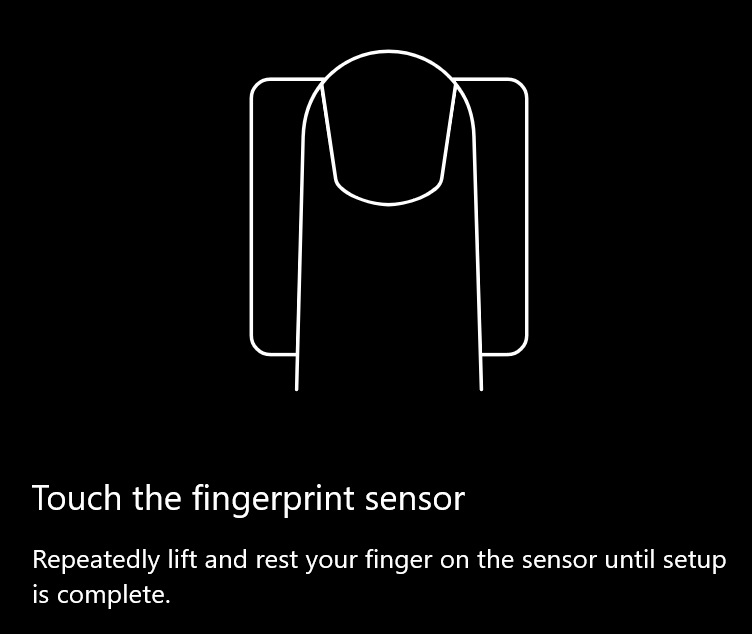

# Utilize a opção de desbloqueio de impressões digitais no Windows 10Use fingerprint unlock option in Windows 10

**Ativar a impressão digital do Windows Hello****Enable Windows Hello Fingerprint**

Para desbloquear o Windows 10 utilizando a sua impressão digital, é necessário configurar a Impressão Digital Windows Hello adicionando (permitindo que o Windows aprenda a reconhecer) pelo menos um dedo.To unlock Windows 10 using your fingerprint, you need to set up Windows Hello Fingerprint by adding (letting Windows learn to recognize) at least one finger. 

1. Aceda a **Definições > Contas > opções de inscrição** (ou clique [aqui).](ms-settings:signinoptions?activationSource=GetHelp)Go to **Settings  > Accounts > Sign-in options** (or click [here](ms-settings:signinoptions?activationSource=GetHelp)). As opções de inscrição disponíveis serão listadas.Available sign-in options will be listed. Por exemplo:For example:

    

2. Clique ou toque no **Windows Hello Fingerprint** e, em seguida, clique em **Configurar**.Click or tap **Windows Hello Fingerprint**, then click **Set up**. Na janela de configuração Do Windows Hello, clique **em Iniciar**.In the Windows Hello setup window, click **Get started**. O sensor de impressões digitais será ativado, e ser-lhe-á pedido que coloque o dedo no sensor:The fingerprint sensor will activate, and you'll be asked to place your finger on the sensor:

   

3. Siga as instruções, que lhe pedirão para digitalizar repetidamente o dedo.Follow the instructions, which will ask you to repeatedly scan your finger. Quando isto estiver terminado, terá a opção de adicionar outros dedos que pode querer usar para iniciar sinsus.When this is finished, you'll have the option of adding other fingers you may want to use for sign-in. Da próxima vez que iniciar sôs no Windows 10, terá a opção de usar a sua impressão digital para o fazer.Next time you sign in to Windows 10, you will have the option of using your fingerprint to do so.

**Windows Hello Fingerprint não disponível como opção de inscrição****Windows Hello Fingerprint not available as a sign-in option**

Se o Windows Hello Fingerprint não for apresentado como uma opção nas **opções de inscrição,** significa que o Windows não tem conhecimento de nenhum leitor/scanner de impressões digitais anexado ao seu PC, ou que uma política do sistema impede a sua utilização (se, por exemplo, o seu PC for gerido pelo seu local de trabalho).If Windows Hello Fingerprint is not shown as an option in **Sign-in options**, it means Windows is not aware of any fingerprint reader/scanner attached to your PC, or that a system policy prevents its use (if for example your PC is managed by your workplace). Para resolver problemas:To troubleshoot: 

1. Selecione o botão **Iniciar** na barra de tarefas e procure **por Gestor de Dispositivos**.Select the **Start** button in the Taskbar and search for **Device Manager**.

2. Clique ou toque para abrir o **Gestor de Dispositivos**.Click or tap to open **Device Manager**.

3. No Device Manager, expanda os dispositivos Biométricos clicando no seu chevron.In Device Manager, expand Biometric devices by clicking its chevron.

   

4. O seu scanner de impressões digitais deve ser listado como um dispositivo biométrico, como o scanner Synaptics WBDI:Your fingerprint scanner should be listed as a biometric device, such as the Synaptics WBDI scanner:

   

5. Se o seu scanner de impressões digitais não for mostrado e o scanner estiver integrado no seu PC, aceda ao site do fabricante do PC.If your fingerprint scanner is not shown, and the scanner is integrated into your PC, go to the PC manufacturer's website. Na secção de suporte técnico do seu modelo para PC, procure um controlador Windows 10 para obter um scanner que possa instalar.In the technical support section for your PC model, search for a Windows 10 driver for a scanner that you can install.

6. Se o scanner estiver separado do PC (ligado via USB), vá ao site do fabricante do scanner para encontrar e instalar o software do controlador do dispositivo Windows 10 para o modelo de scanner que tem.If the scanner is separate from the PC (attached via USB), go to the scanner manufacturer's website to find and install Windows 10 device driver software for the scanner model you have.
