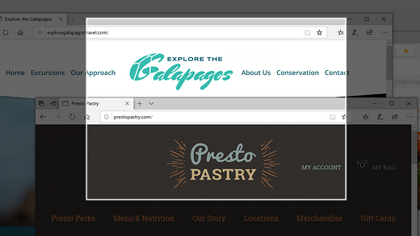
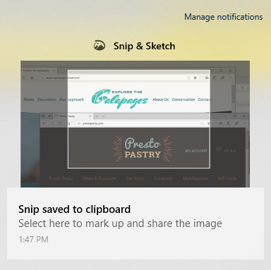

# Use o Esboço de & snip para capturar, marcar e partilhar imagensUse Snip & Sketch to capture, mark up, and share images

O esboço de ecrã chama-se **Snip & Sketch.**Screen sketch is now called **Snip & Sketch**. **Para tomar rapidamente um corte:****To quickly take a snip**:

1. Prima a **tecla do logótipo**do Windows + Shift + S . Verá o seu ecrã escurecer e o seu cursor exibido como uma cruz.Press the **Windows logo key + Shift + S**. You'll see your screen darken and your cursor displayed as a cross. 

2. Escolha um ponto na borda da área que pretende copiar e clique no cursor à esquerda.Choose a point at the edge of the area you want to copy and left-click the cursor. 

3. Mova o cursor para realçar a área que pretende capturar.Move your cursor to highlight the area you want to capture. A área que capturar aparecerá no seu ecrã.The area you capture will appear on your screen.

   

A imagem que cortou é guardada na sua área de transferência, pronta para colar num e-mail ou documento.The image you snipped is saved to your clipboard, ready for pasting into an email or document. 

**Se quiser editar ou ver a imagem:****If you want to edit or view the image**: 

- Clique no ícone de notificações no lado direito da barra de tarefas; em seguida, clique na imagem que acabou de capturar.Click the notifications icon at the far right side of the taskbar; then click the picture you have just captured. O seu corte abre-se na aplicação Snip & Sketch.Your snip opens in the Snip & Sketch app.

   
