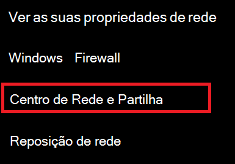

# Ver Wi-Fi palavra-passe de rede no Windows 10

1. Certifique-se de que o seu PC Windows 10 está ligado à rede Wi-Fi.

2. Vá a **Definições > Rede & Estado de > da Internet**, ou clique ou toque [aqui](ms-settings:network?activationSource=GetHelp) para nos deixar levá-lo lá agora.)

3. Clique em **Network and Sharing Center**.

    

4. No **Network and Sharing Center**, junto às **Ligações,** verá o nome da sua rede sem fios. Por exemplo, se a sua rede estiver chamada "ABC123", poderá ver:

    

    Clique no nome da rede sem fios para abrir a janela Wi-Fi Status. 

5. Na janela status Wi-Fi, clique em **Propriedades Sem Fios,** clique no separador **Segurança** e verifique os caracteres **Do Show**.

    

